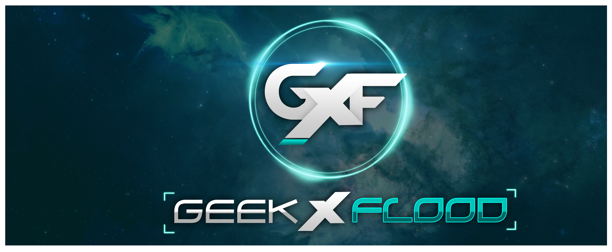

  

🚀 Geekxflood is a personal project of a developer who loves to work with Prometheus and create cool stuff using Go. 

👨‍💻 The goal of this project is to explore the capabilities of Prometheus and Go by building interesting applications and tools.

🤖 The project includes various components such as Prometheus exporters, custom metrics, and Go libraries that can be used to build Prometheus-based applications.

📈 Whether you're a Prometheus enthusiast or a Go developer looking for new ideas, Geekxflood is a great place to start exploring.

🌟 Geekxflood is an open-source project, and we welcome contributions from the community. 

👋 If you're interested in contributing or have any questions, feel free to reach out to us.

